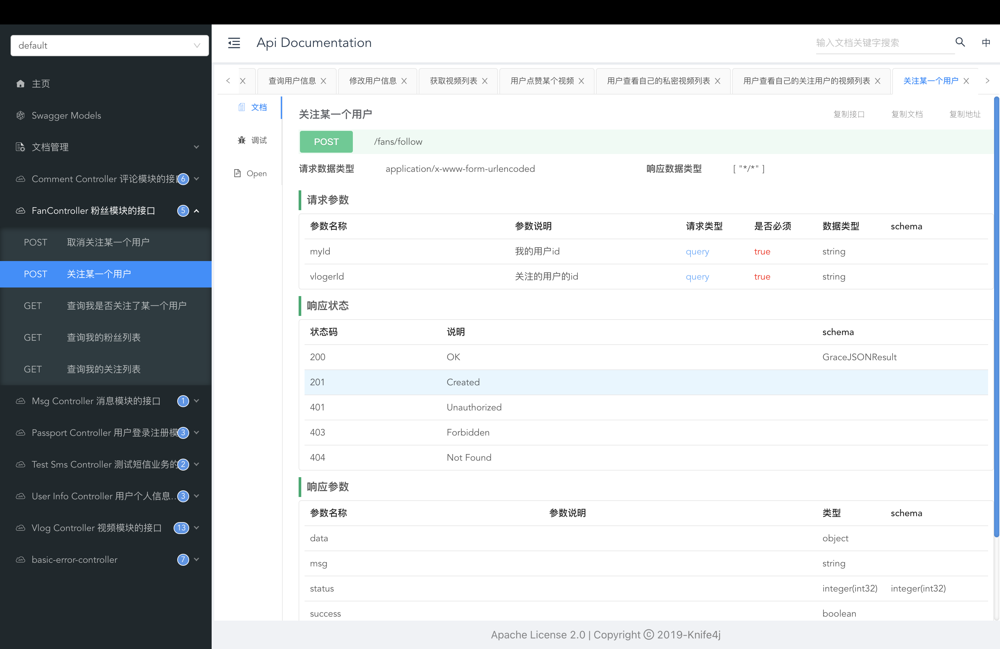
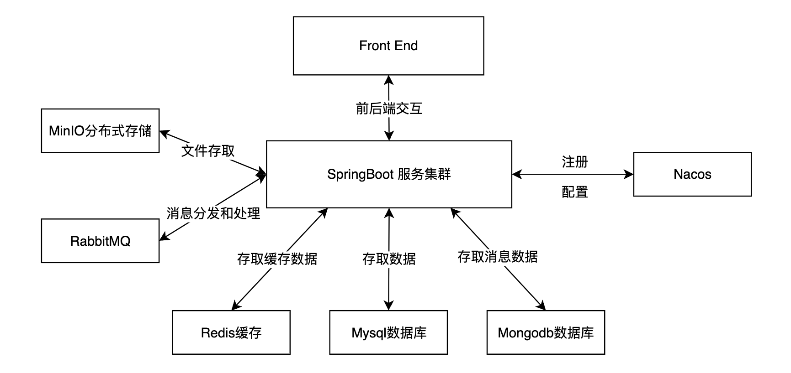

# Mini-Douyin(version-1.0)

本项目基于SpringBoot参考抖音的业务逻辑实现了一个mini-douyin，该项目关注的是后端实现。

## 后端接口展示

该项目使用[knife4j](https://doc.xiaominfo.com/)这个API文档工具，这是部分API的展示，完整的API可以参考[markdown格式的API文档](mini-douyin-api.md)。

## 业务分析

### 用户模块

* **用户登录注册**：通过手机号、验证码登录注册
* **查看个人信息**
* **修改个人信息**：如头像、背景、昵称、出生日期
* **关注/取关用户**
* **查看关注/粉丝列表**

### 视频模块

* **上传视频**
* **刷视频**（本来应该是推荐系统推荐的，该项目目前是返回所有视频）
* **搜索视频**
* **观看某个视频**
* **点赞/取消点赞视频**
* **查看自己公开/私密视频列表**
* **查看自己点赞过的视频**
* **查看自己关注博主的视频列表**
* **查看自己朋友的视频列表**

### 评论模块

* **评论某个视频/评论**
* **删除评论**
* **点赞/取消点赞某个视频**

### 消息模块

* **查看消息**（关注、点赞、评论）

## 技术架构

### SpringBoot

**Spring**的两大特性**IOC**和**AOP**很大程度上便利了开发，而**Spring WebMVC**和**Spring Data**也分别为基于servlet的web开发和数据库存取数据提供了便利，但是在SpringBoot出现之前，对于Spring的配置十分的复杂繁琐，称为配置地狱。**SpringBoot**提供了一系列starter默认配置项，大大简化了配置的流程，我们只需要先引入starter再配置少量的个性化配置即可开始我们的项目开发。而目前SpringBoot作为java的杀手级框架，是众多java项目的不二之选，这也是我选择它的理由。

### Mysql

Mysql是一款经典的关系型数据库，其历史悠久、用户庞大。在该项目中，我用其来存储大部分数据，比如**用户数据**、**视频数据**、**评论数据**、**关注关系数据**等。

#### MyBatis

MyBatis 是一款优秀的持久层框架，它支持自定义 SQL、存储过程以及高级映射，其实现了sql语句和java代码之间的解耦。在该项目中我使用了该框架来编写sql语句实现mysql数据库的增删改查。

#### MyBatis Generator

MyBatis Generor可以根据数据库中的表自动生成mysql语句，我在该项目中使用mybatis generator结合tk.mybatis插件快速生成了一些对应于常用mysql语句的mapper映射文件和接口。

### Redis

Redis是一种nosql的kv数据库，其的数据以键值对的形式存储在内存中，因此常被用于作为缓存。在该项目中我使用其来存储一些临时数据，比如用户登录的短信验证码（key为用户手机号）、我的关注总数、我的粉丝总数等。

### Mongodb

Mongodb是json数据库，其存储的基本数据单元是一条条json数据，我使用其来存储消息数据（消息数据就是某个用户点赞、关注或者评论了另一个用户，另一个用户会收到的消息提示。）

### RabbitMQ

RabbitMQ是一个消息中间件，其能够作为一个代理来控制消息的转发，在该项目中其主要负责的就是对于上面消息数据的处理。RabbitMQ解耦了消息发送和接受，如果不引入RabbitMQ，消息发送者除了消息的发送，还需要关注消息是否被接收（因为消息有可能会丢失），但是引入了RabbitMQ之后，消息发送者只需要通知RabbitMQ，然后发送消息即可。同时引入RabbitMQ，其异步特性可以有效地将巨大的消息流量摊平到一个大的时间维度上。

### MinIO

MinIO是一个分布式存储系统，该项目主要使用其来存储图片（用户头像和背景图片），而视频数据其实是前端负责存储的。

### Nacos

Nacos是一个动态服务发现、配置管理和服务管理平台，其可以用来管理微服务。这里引入它只是为了尝试使用spring cloud和配置中心。

## 项目模块结构分析

* **douyin-api**：该模块提供了前端交互的接口，也就是controller层
* **douyin-service**：该模块是service层，主要的业务逻辑都在这个部分
* **douyin-mapper**：该模块是dao层，负责和数据层（如mysql、mongodb）交互，存取数据
* **douyin-model**：该模块存放的是实体类对象
* **douyin-common**：该模块存放的是一些工具类

## 一些官方文档

1. [SpringBoot](https://docs.spring.io/spring-boot/docs/current/reference/html/)
2. [Spring Data](https://docs.spring.io/spring-data/commons/docs/current/reference/html/#repositories)
3. [Spring Data Redis](https://docs.spring.io/spring-data/data-redis/docs/current/reference/html/)
4. [Spring AMQP](https://docs.spring.io/spring-amqp/docs/current/reference/html/#reference)
5. [MyBatis](https://mybatis.org/mybatis-3/zh/index.html)
6. [MyBatis Generator](http://mybatis.org/generator/running/runningWithJava.html)
7. [Redis](https://redis.io/docs/)
8. [Mongodb](https://www.mongodb.com/docs/manual/tutorial/getting-started/)
9. [RabbitMQ](https://www.rabbitmq.com/getstarted.html)
10. [MinIO](https://min.io/)
11. [Nacos](https://nacos.io/zh-cn/index.html)
12. [Knife4j](https://doc.xiaominfo.com/)
13. [Lombok](https://projectlombok.org/features/)
14. [Jackson](https://www.baeldung.com/jackson)
15. [Tecent Cloud Sdk](https://github.com/TencentCloud/tencentcloud-sdk-java)

# Future Version

* Elasticsearch实现搜索功能
* Admin后台管理
* 抖音商城模块（提供支付功能）
